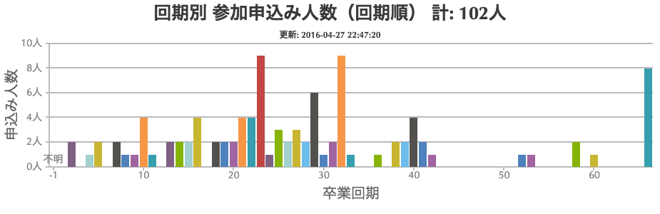
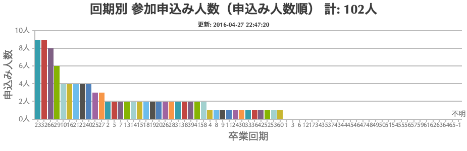

# 回期別 参加申込み人数のグラフを作るスクリプト

同窓会の参加申し込みの回期別の傾向を見るためのグラフを作成する。
グラフのデータを作成するには、回期の入力された参加者リストが必要（ここには置いていない）。

## 作成手順

1. canvasjs.min.jsを取得して、このディレクトリに置く（改変してWebサイトをリンクするか？）
1. 最新の参加者リストを取得する
1. スクリプトを実行してグラフ作成用スクリプトを生成する
1. Webブラウザで、entries_chart.htmlを表示する
1. グラフが表示できたら、右上の四角いボタンをクリックして「Save as JPG」か「Save as PNG」を選択してファイルに保存する

### 生成スクリプトの実行方法

```shell
python make_entries_chart.py <参加者リストのエクセルシート>
```

### 作成したグラフ

回期別のグラフの例（最新ではありません）：



申し込み人数順のグラフの例（最新ではありません）：


